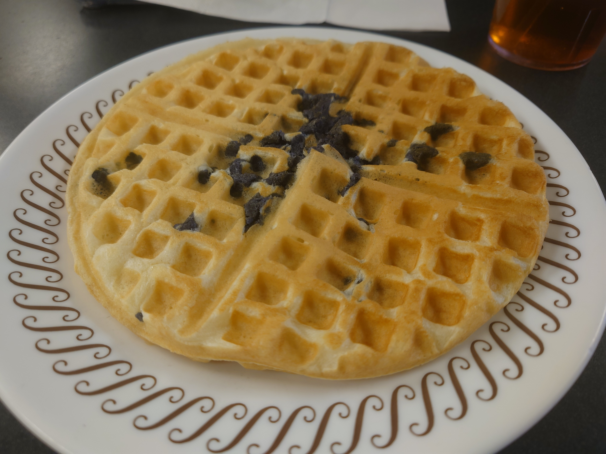
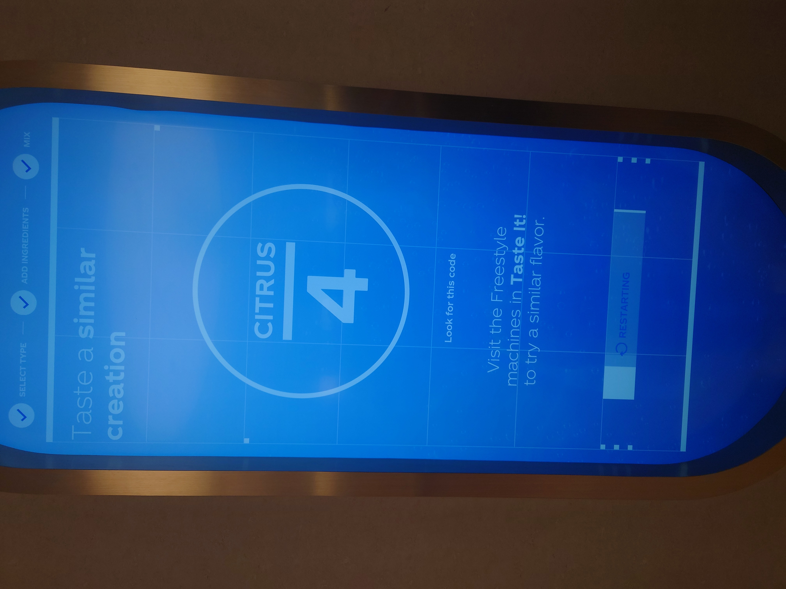
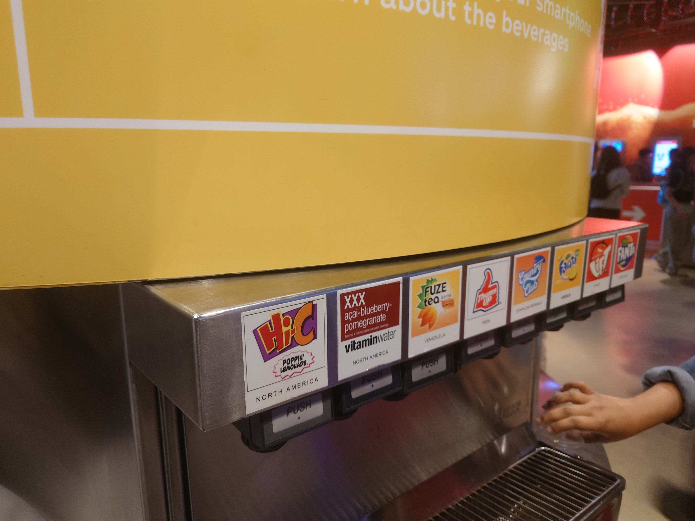
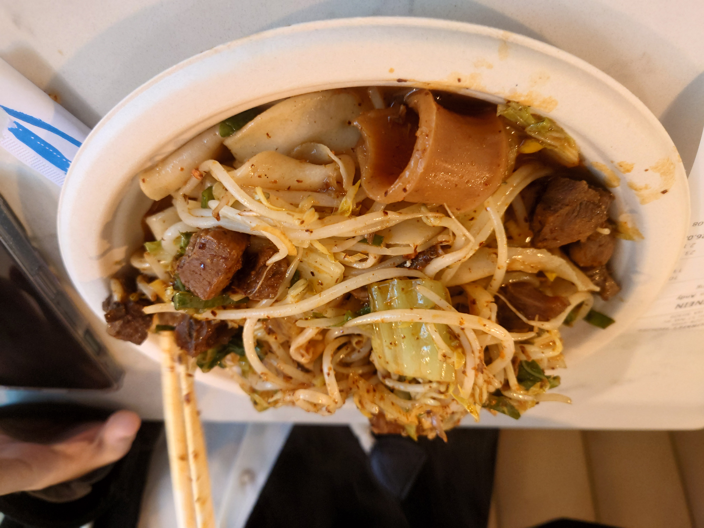
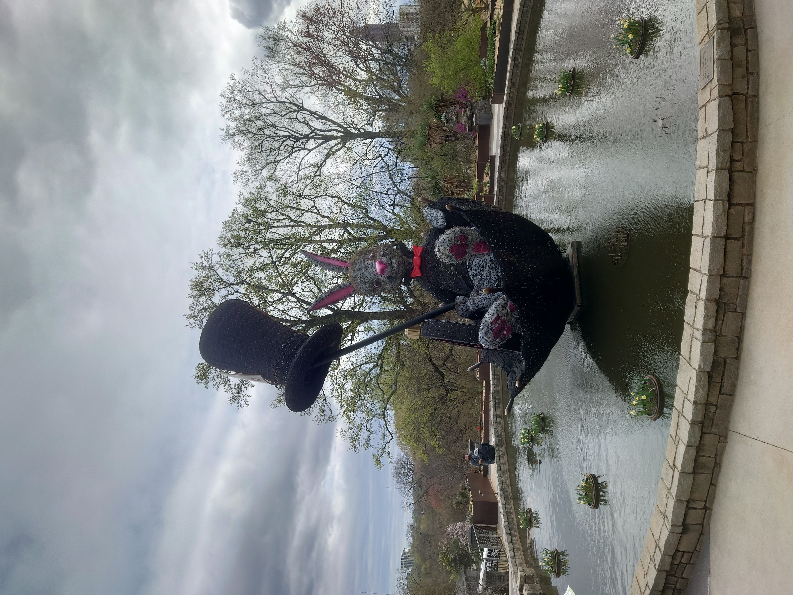
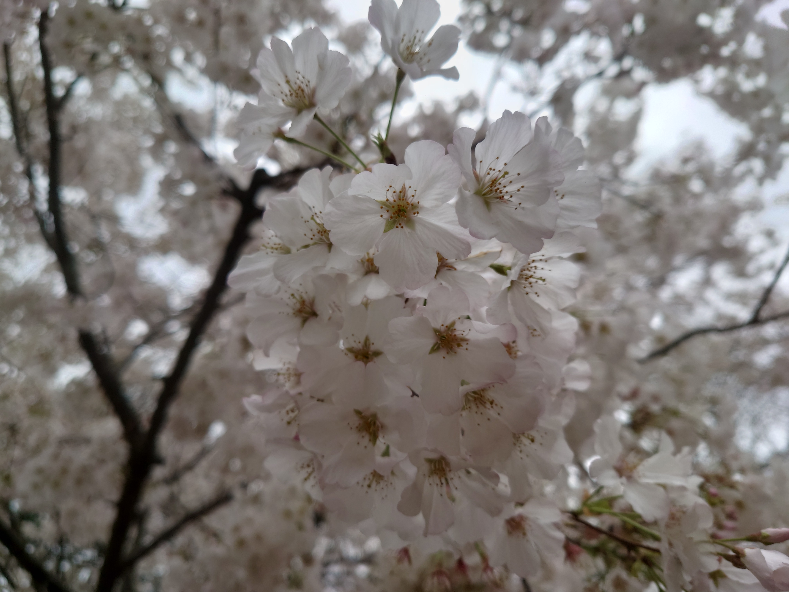
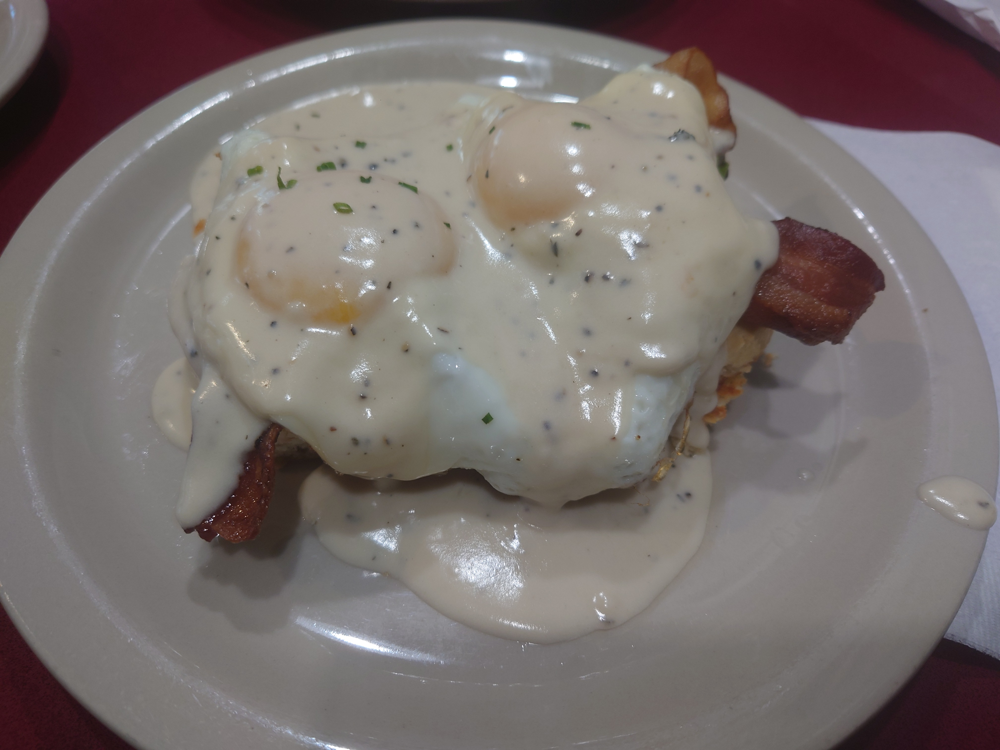
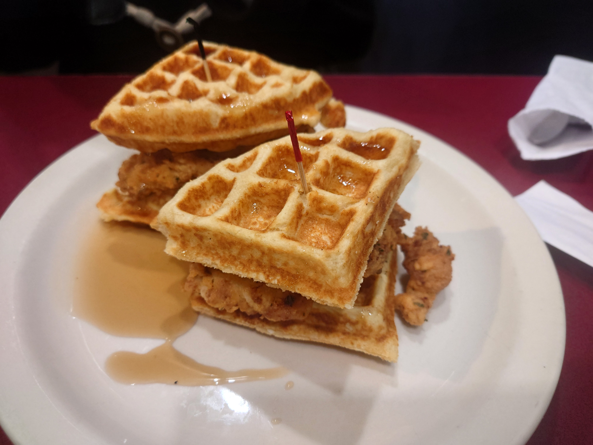

# Atlanta旅行

## Day1

19:30 到达ATL机场，打车入住酒店，晚饭在酒店旁边Park27 Korean BBQ打包了一点，烤肉和牛肉汤非常不错，但有一点点小贵。

## Day2

8:00 起床吃了顿Waffle House，12刀两个人吃饱，性价比属于是非常高了。

9:00 入场水族馆，海豚和海狮表演非常可爱（可惜表演过程中不让拍照），还有几个水池专门放可以摸的鱼。



12：30 中饭前去了World of Coca-Cola，前几个房间讲了讲Coca-Cola的历史，但可能对并不喜欢喝可乐的我来说不太感兴趣，后面可以通过自选口味给出最适合的饮料类型的互动感觉挺有意思，但得到的饮料喝起来完全不是我想象中的样子。

最后还有几十台机子可以接不同口味的可口可乐公司的不同饮料，但尝了很多还是觉得原味可乐最好喝。

14:00 吃中饭，盲选的西安面馆居然还是后来当地某位博士同学的推荐日常餐厅，味道不错价格也还行。

  
  

15:00 抵达Atlanta Botanical Garden，花园相当大，规划的走起来也很舒服，春天里也能看到很多花，虽然当天天气没有阳光明媚，没法拍很华丽的全景图，但近处看看花还是很不错的。

  
  

  
  

18:00 到达Ponce City吃晚饭+夜宵。先到一个甜品店吃了点咖啡慕斯，店里也有看起来挺漂亮的马卡龙，但再吃甜的就有点过于腻了。

  
  

有个听说很不错的炸鸡，但到的时候带骨的卖完了，不带骨头的就有点柴，虽然酱汁还不错，但还是有点难以救回来。晚饭是一份拉面和柚子鸡尾酒，店员说非常strong，确实两个人分着喝都没喝完。

  
  
  

吃完饭最后逛了逛，有一家很大的卖各种厨房用品的店。有什么一百多刀的胡椒粉瓶，几百刀一套的盘子和餐具，上千刀的咖啡机，也不知道质量如何，但大抵是不太消费得起的。

## Day3

起床吃了顿早餐就坐飞机回家了。早餐据说是传统南方农场主早餐？确实看起来非常美式，非常传统。松饼比Waffle House蓬松一点，炸鸡和煎蛋三明治也很不错，但价格总共两个人四十多刀确实也比Waffle House贵得多。

  
  

